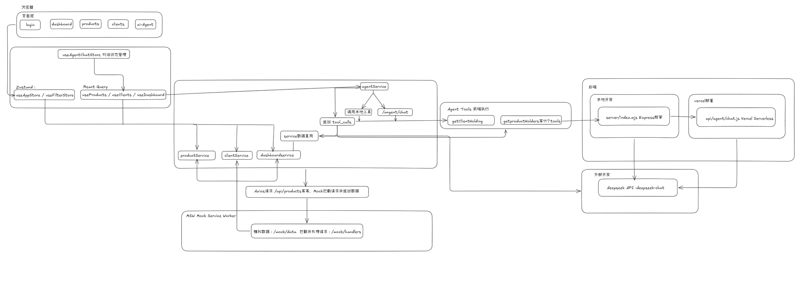
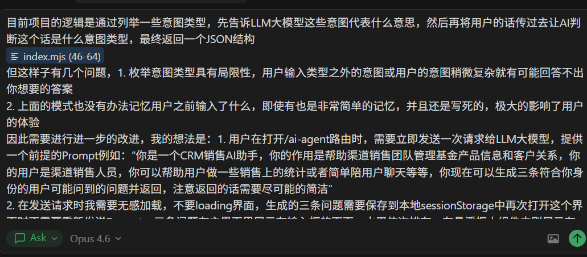
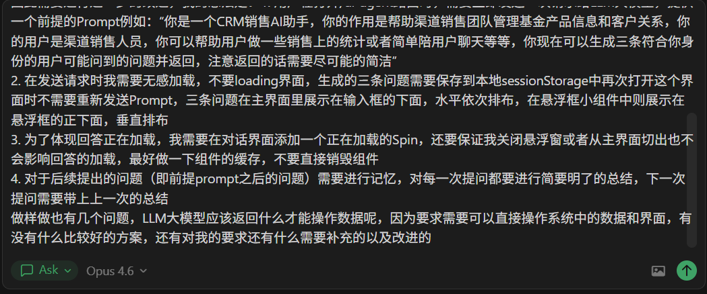
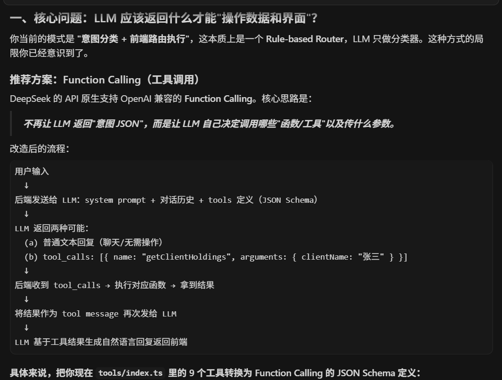
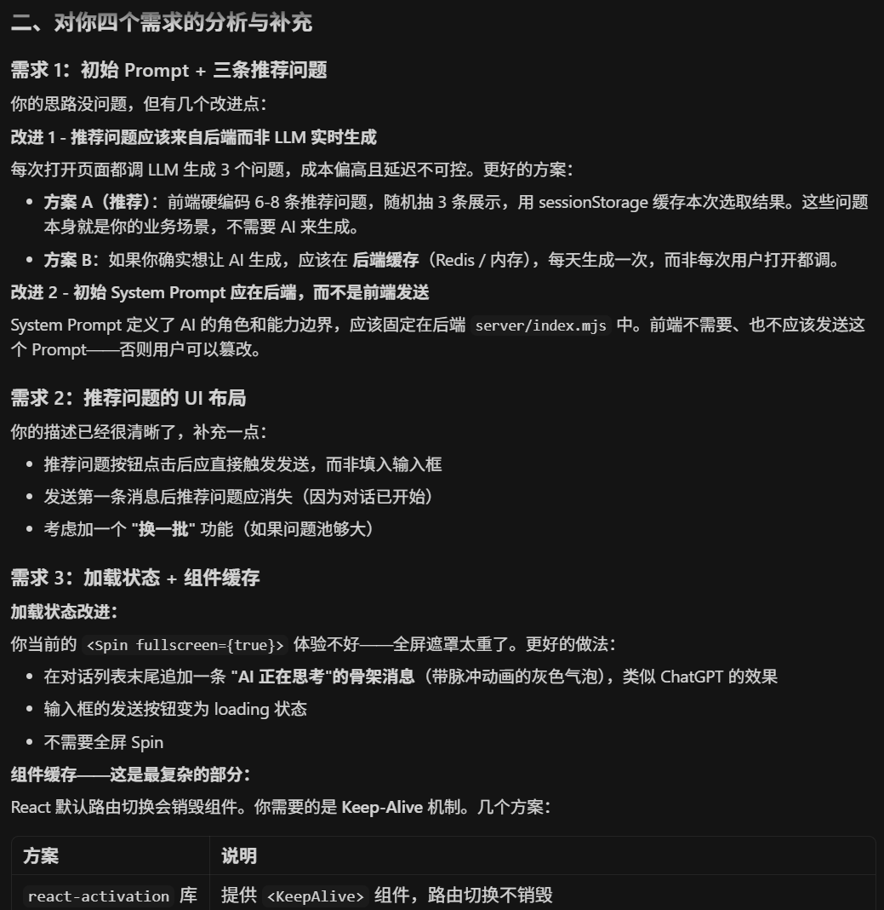
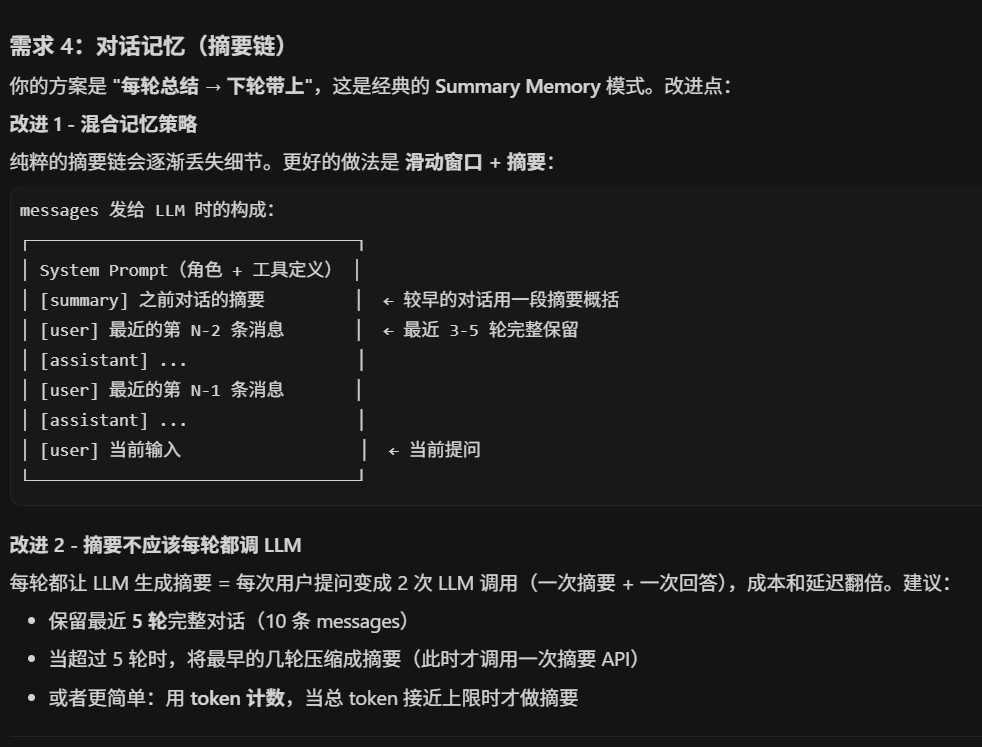
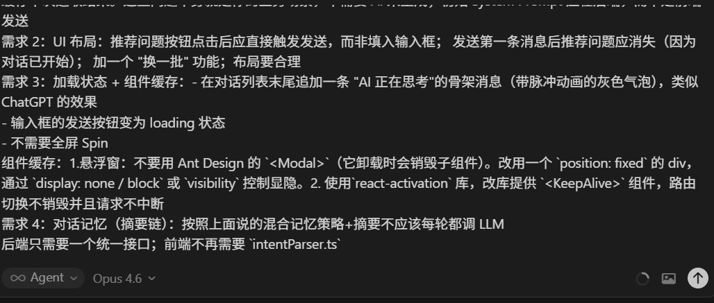
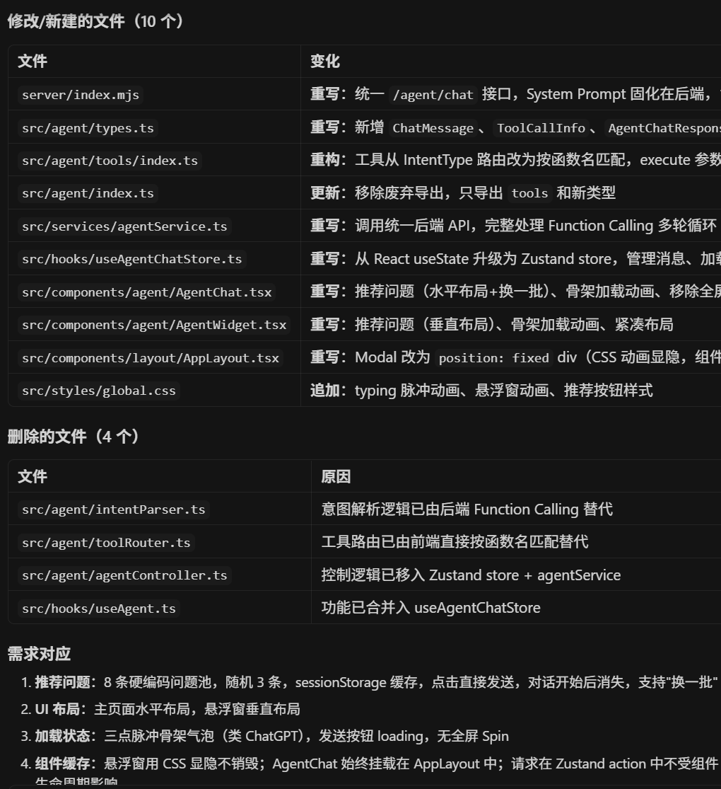

# 1.需求分析

#### 如何理解这个场景的

- 首先这个需求的背景是：资管公司需要⼀个内部 Web ⼯具，帮助渠道销售团队管理基⾦产品信息和客户关系。

  你的⽤户是**渠道销售⼈员**，因此得围绕用户身份来进行功能设计和模块划分

#### 我目前做了哪些功能

- 目前CRM系统有以下几个功能：

  - dashboard数据概览模块，在该模块展示了总产品数、在售产品数、客户总数、本月新增客户、本月新增认购，第二行展示了产品规模占比的饼状图、客户风险与产品类型的交叉柱状图，第三行展示了近 6 个月新增客户趋势和最近跟进记录
  - product产品货架模块，展示了公司在售基⾦产品的关键信息（类型、净值、规模、状态等），并可以查看详情，看到客户持有概览以及净值走势，可以通过搜索模块搜索产品、产品类型、状态等
  - client客户模块，展示了客户的基本信息，并且可以根据客户姓名、电话、客户等级、风险偏好等进行搜索，点击对应行可以进入客户的详情信息页，在详情信息页可以查看持仓信息、跟进记录等信息，也可以在此新增跟进（也可以通过AI助手直接新增跟进记录）
  - Agent模块，引入了deepseek大模型，可以通过对话完成一些简单任务，例如：“查看当前高风险产品有哪些”；“帮我绘制高风险产品的饼状图”等，实现了对数据的查询、绘制图表、做一些简单的任务等，并且可以记忆对话

#### 为什么要设计以上的功能

- **为什么设计以上的模块：**
  1. 因为用户是销售人员，需要帮助销售团队**快速了解业务全貌**，展示以上的数据可以让用户更快的了解产品和客户的全貌
  2. 添加的Agent模块，可以**快速的查询产品和客户的信息提升效率**，并且可以对数据进行统计绘制成用户想要的图表

#### 有什么你认为重要但因时间有限没做的

- 对**Agent模块进行更进一步的优化**，因为时间原因目前Agent模块还有很大的局限性
- **增加设置模块**，包括对主题颜色的改变，用户头像昵称的改变等
- 目前这个系统只是面向的普通渠道销售人员的，后续可以**增加对于销售经理等管理人员**的模块，通过人员身份进行权限控制，增加人员管理、客户管理、产品管理等模块，可以对其进行增删改等操作

#### 再给我 2 天我会优先做的

- **增加设置模块**和对于**销售经理等管理人员的模块**，这两个模块可以较快的搭建，功能相对简单，而Agent模块的更进一步优化的工程量和难度都相较于其他的模块更难
- 并且对Agent模块进行优化需要大量的后端进行配合，例如新增流式传输需要后端设置SSE等

# 2.技术选型

#### 技术选型方案：

- **基础架构：**React18 + TypeScript + Vite + React Router
- **状态管理：**Zustand
- **数据请求：**TanStack Query (React Query)
- **UI方案：**Ant Design
- **图表：**Recharts
- **Mock数据：**Mock Service Worker
- **部署：**Vercel

#### 为什么选择这些

- TypeScript可以更好的提供类型支持，可以用interface、type等定义类型，减少因为数据类型产生的错误
- Vite：直接用Vite创建的项目，因为目前`react-create-app`已经被淘汰了
- 状态管理使用Zustand更加轻量、相对于Redux体量较小，适合小型项目
- 数据请求使用React Query，它拥有更好的缓存、loading管理和错误处理机制
- 使用Mock进行数据的伪造，模拟真实的接口

#### 架构图：

见仓库里的`架构图.excalidraw`可以使用https://excalidraw.com/进行导入查看

# 3. AI 协作⽇志

#### 我在哪些环节使用了AI：

1. 基础页面的搭建，通过`v0design`搭建页面基础结构，并让其使用MSW伪造一些基本的数据
2. Agent模块的搭建，我通过提出详细的要求使用Claude Opus 4.6搭建Agent模块并对其进行改进

#### 具体的 prompt：

以Agent模块为例：最开始AI生成的方案是通过**意图分析+前端路由的执行**，逻辑是通过列举一些意图类型，先告诉LLM大模型这些意图代表什么意思，然后再将用户的话传过去让AI判断这个话是什么意图类型，最终返回一个JSON结构，在根据JSON里面type类型进行执行相应的方法，因此我将问题指出，并结合自己的想法让AI针对我的想法提出补充和改进建议：

**AI的输出：**

#### 最后我对AI的回答进行总结，并选择改进方案

**最终修改结果**

### AI 在这个项⽬⾥帮到你最多和最帮不上忙的地⽅分别是什么：

- **帮忙最多**的就是基础页面的搭建，你提供需求AI可以准确的搭建，提供需求时需要尽可能描述详尽，需要分为几个部分，每个部分都有哪些模块，每个地方需要放一些什么

- **最帮不上忙**的是大需求的改进，例如Agent模块，最开始生成的有很大的问题，你最好可以把问题点出来并提供自己的想法以及改进意见，如果直接让AI改进会效果不好，改不到点上
- 对于一些大项目，各个模块的耦合可能比较高，让AI直接修改某一个模块会牵一发动全身，导致难以预料的bug

# 4. ⾃我复盘

#### 你已知但来不及修的问题：

- Agent模块应答速度较慢，需要更换更好的API
- 目前Agent模块没有流式传输

#### 如果这是真实的企业项⽬，你会做哪些不同的决策

1. 在会建立详尽的计划，对于一些以后可能会开发的地方预留接口等，例如全局主题的变化等
2. 在真实的企业项目中肯定是全后端分离的，需要与后端统筹安排进度，不再使用MSW伪造数据
3. 对于UI布局有了Figma文档就不再让AI随意生成布局，需要根据给的布局一比一复刻
